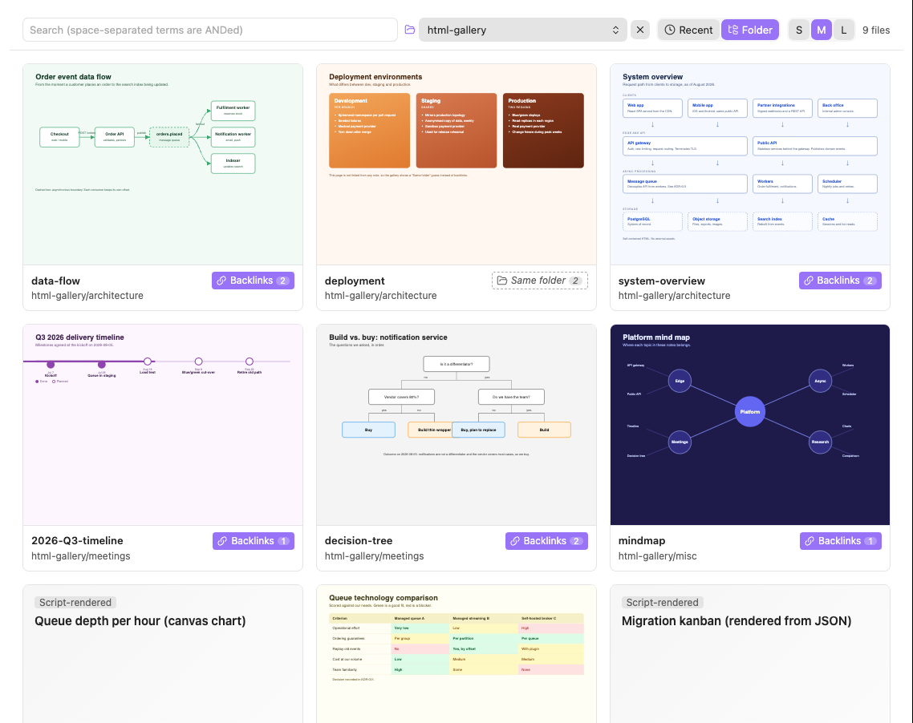
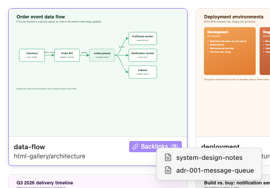
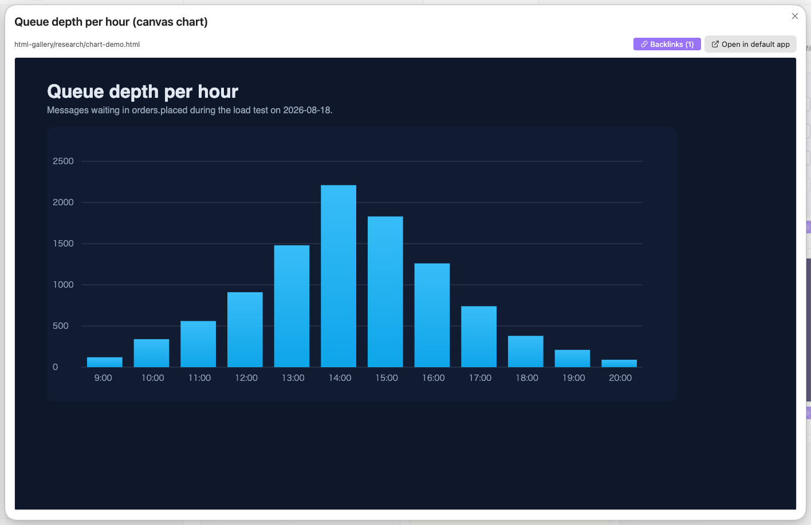
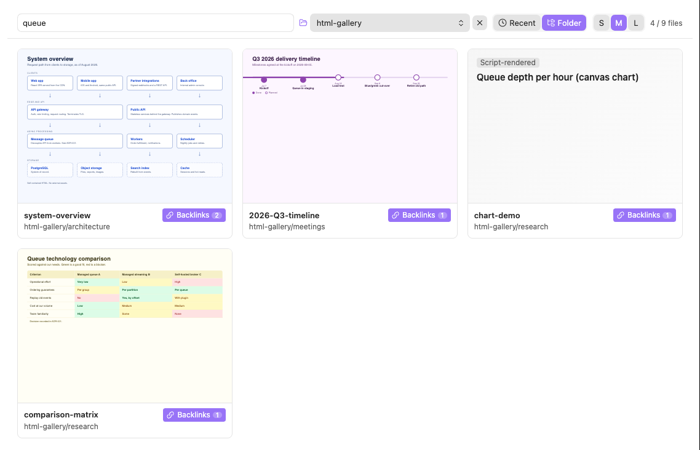

# HTML Gallery（Obsidian プラグイン）

[English README](README.md)

保管庫の中のHTMLファイルを一覧表示し、HTMLを参照するノートへ辿ることができるプラグインです。

ノートと一緒にHTMLの図解を保存していると、「あの絵は見た覚えがあるのに、ファイル名もフォルダも思い出せない」ということが起きます。HTML Gallery はすべての HTML を縮小表示で並べて目で探せるようにし、各カードの下にそのファイルへリンクしているノートへのボタンを付けます。



## できること

- 保管庫内のすべてのHTMLを、実物を縮小したサムネイルで一覧します。
- 各カードの「バックリンク」ボタンから、そのファイルにリンクしているノートをワンクリックで開くことができます。どこからもリンクされていないファイルには「同フォルダ」の候補を出し、同じメニューから候補のノートにリンクを追加して確定させることもできます。
- ファイル名・タイトル・本文テキストで検索でき、更新順とフォルダ順で並び替えができます。フォルダ順ではフォルダ名の見出しで区切って表示します。
- フォルダを選んで絞り込むことができます。ファイルエクスプローラーでフォルダを右クリックして、そのフォルダ内で絞り込むことも可能です。
- カードをクリックすると大きく表示します。ここではスクリプトが動くので、対話的なページやライブラリを使ったページも本来の姿で見ることができます。
- カードを右クリックすると、埋め込みリンクやパスのコピー、ファイルエクスプローラーで表示、既定のアプリで開く、ができます。
- 今開いているノートと同じフォルダにある、まだリンクしていない HTML を選んでリンクを挿入するコマンドがあります。
- キーボードだけでも操作できます。矢印キーでカードを移動、Enter で拡大表示、`/` で検索欄に移動します。
- UI は英語と日本語に対応しています。

## スクリーンショット

[`examples/`](examples/) のサンプルを使って撮っています（UI は英語表示です）。このフォルダを保管庫にコピーすれば同じ内容で試せます。

各カードのボタンを押すと、そのファイルにリンクしているノートの一覧が出ます。どこからもリンクされていないファイルは、点線の「同フォルダ」ボタンになり、同じフォルダで更新時刻が近いノートを候補として出します。



JS で描画するページは一覧ではテキストの代替表示になりますが、拡大表示では常にスクリプトが動くので本来の姿で見えます。



検索はファイル名・タイトル・本文テキストに対して行います。「queue」で 9 件が 4 件に絞られています。



## 利用の前提

- Obsidian の設定「ファイルとリンク」で「すべてのファイル形式を表示」を有効にしてください。無効だと HTML が保管庫のファイルとして扱われず、一覧に出ません
- HTML は保管庫の中に置いてください（保管庫外のファイルは対象外です）

## インストール（手動）

1. リリース成果物、または後述のビルドで得た `main.js` `manifest.json` `styles.css` を `<vault>/.obsidian/plugins/html-gallery/` に置きます
2. Obsidian の設定「コミュニティプラグイン」で HTML Gallery を有効にします
3. 左のリボンのアイコン、またはコマンドパレットの「HTML Gallery: ギャラリーを開く」で開きます

## コマンド

| コマンド | 動作 |
|---|---|
| ギャラリーを開く | ギャラリービューを開きます（開いていればそこへ移動します） |
| このフォルダの HTML へのリンクを挿入 | 今開いているノートと同じフォルダにある、まだそのノートからリンクしていない HTML を一覧し、選んだものへの埋め込みリンクを挿入します（エディタではカーソル位置、それ以外はノート末尾） |

## 設定

| 項目 | 既定 | 説明 |
|---|---|---|
| 言語 | 自動 | 自動（Obsidian の設定に従う）/ English / 日本語 |
| サムネイル内のスクリプトを有効にする | オフ | オンにすると一覧でも JS を実行します。件数が多いと重くなります |
| サムネイルのサイズ | 中 | 小 / 中 / 大。ギャラリーのヘッダーからも切り替えられます |
| 対象フォルダ | 空（保管庫全体） | このフォルダ配下だけを一覧します |
| 除外フォルダ | 空 | 改行区切りで複数指定できます |
| index.html を一覧に含める | オフ | 入口ページを一覧に出すかどうか |

## サンプル

[`examples/`](examples/) に、挙動を一通り確かめられる図解とノートの小さなセットを置いています。リンクあり・なしの HTML、バックリンクが2件あるファイル、テキスト代替表示になる JS 描画ページ2枚、既定で隠れる `index.html` が含まれます。保管庫内の任意の場所にコピーすれば試せます。

## 開発

TypeScript + esbuild 構成です（Obsidian 公式サンプルプラグインと同じ）。

```sh
npm install
npm run build   # 型チェック + main.js を生成
npm run dev     # 監視ビルド
```

開発中は、このリポジトリのディレクトリを保管庫のプラグインフォルダにシンボリックリンクすると、ビルドのたびに Obsidian へ反映できます。

```sh
ln -s "$(pwd)" "<vault>/.obsidian/plugins/html-gallery"
```

Obsidian 側の再読み込みは、Obsidian CLI があれば `obsidian plugin:reload id=html-gallery`、無ければコマンドパレットの「アプリを再読み込み」で行います。エラーは開発者ツール（`Cmd+Option+I` / `Ctrl+Shift+I`）のコンソールに出ます。

### ソース構成

| ファイル | 役割 |
|---|---|
| `src/main.ts` | プラグイン本体。ビュー・コマンド・設定タブ・フォルダ右クリックメニューの登録 |
| `src/view.ts` | ギャラリービュー（ヘッダー、グリッド、フォルダ見出し、遅延読み込み、縮尺計算、キーボード操作、カードの右クリックメニュー、イベント購読、フォルダ絞り込み状態） |
| `src/thumbnail.ts` | サムネイル iframe の生成と縮尺、リソース URL のキャッシュ |
| `src/indexer.ts` | HTML の解析（title・本文・空判定）と検索索引 |
| `src/backlinks.ts` | `resolvedLinks` の逆引きと同フォルダ推測 |
| `src/note-menu.ts` | 参照ノート一覧のメニュー（推測候補には「リンクを追加」付き） |
| `src/links.ts` | 埋め込みリンクの生成とノートへの挿入 |
| `src/link-suggest-modal.ts` | 「リンクを挿入」コマンドの候補選択 |
| `src/files.ts` | 対象 HTML ファイルの収集とフィルタ |
| `src/preview-modal.ts` | 拡大表示モーダル |
| `src/i18n.ts` | UI 文字列（英語 / 日本語） |
| `src/icon.ts` | リボン・ビュー用の独自アイコン |
| `src/settings.ts` / `src/settings-tab.ts` | 設定の型・既定値と設定タブ |
| `styles.css` | スタイル。色は Obsidian の CSS 変数を使いテーマに追随します |

### 実装上の注意

- サムネイルは実ファイルを `<iframe>` で読み込み、幅 1280px の仮想ビューポートを CSS で縮小しています。枠に合わせて縮めるとレスポンシブなページがモバイル表示になるためです。画面付近のカードだけを読み込みます
- 既定ではサムネイル内のスクリプトを実行しません。本文がほぼ空（JS 描画のみ）のページは白紙にせず、`<title>` と本文冒頭のテキストで代替表示します
- iframe の `sandbox` は `allow-scripts` と `allow-same-origin` を同時に付けません（サムネイル既定は `allow-same-origin`、スクリプト有効時と拡大表示は `allow-scripts`）
- iframe の `src` は `vault.adapter.getResourcePath()` の戻り値を使い、`file://` を自分で組み立てません
- ファイル内容を `innerHTML` に流し込みません。タイトル・本文の抽出は `DOMParser` で行います
- `onunload` で `detachLeavesOfType` を呼びません
